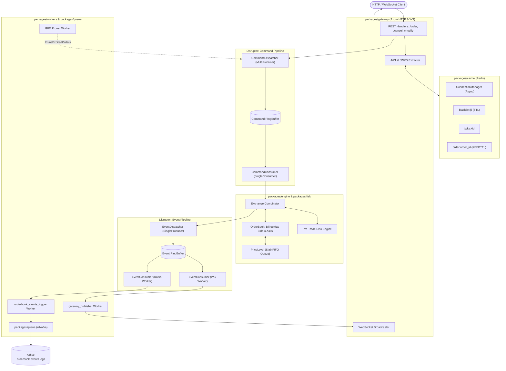

# High-Performance Centralized Exchange (CEX)

A low-latency, high-throughput centralized crypto and stock exchange built with a high-performance **Rust core** and an event-driven **microservices architecture**.

[Benchmark results](benchmarks/bench.md)

---

## 1. Architectural Philosophy

The core execution path is built around **mechanical sympathy** and the **Single-Writer Principle** (inspired by the LMAX Disruptor architecture):

* **Zero I/O in the Hot Path**: The matching engine and risk checks run in a pure in-memory loop on CPU cache. The engine thread never performs database operations, disk I/O, or network calls.
* **Lock-Free Concurrency**: Ingress commands and egress event logs communicate between threads using lock-free Disruptor ring buffers instead of operating system mutexes.
* **Deterministic Event Sourcing**: Every state mutation is sequenced monotonically per trading pair, allowing the orderbook state to be deterministically audited and reconstructed.
* **Stateless Auth Verification**: Downstream services verify asymmetric JWTs locally against cached public keys (JWKS) with sub-millisecond Redis JTI revocation checks.

---

## 2. High-Level Architecture Diagram



---

## 3. Rust Workspace Packages

The Rust core is organized into modular crates within the workspace:

### `packages/domain` (Shared Contracts)
* Defines core trading primitives: `OrderId`, `Price`, `Quantity`, `AssetId`, `UserId`, `Symbol`, and `Side`.
* Houses order structs: `Order`, `NewOrder`, and `ModifyOrder` supporting `GTC`, `FAK`, `FOK`, `GFD`, and `Market` order types.
* Implements `PriceLevel` backed by `Slab<OrderPointer>` for cache-friendly FIFO queuing.

### `packages/risk` (Pre-Trade Risk Engine)
* In-memory account state tracking: `Active`, `Frozen`, `Closed`, and `ReduceOnly`.
* Multi-asset balance tracking split into `available` and `reserved` quantities.
* Atomic balance reservation (`check_and_reserve`), release on cancel/reject (`release`), and post-match asset transfer (`settle`).

### `packages/engine` (Matching Core)
* **`orderbook.rs`**: In-memory `BTreeMap` bids (descending) and asks (ascending) with a price-time priority matching loop.
* **`exchange.rs`**: Multi-symbol coordinator managing orderbooks, risk checks, and monotonic per-symbol sequence generation.
* **`commands.rs`**: Lock-free Disruptor ingress pipeline (`MultiProducer -> SingleConsumer`) accepting `ExchangeCommand` payloads.
* **`events.rs`**: Lock-free Disruptor egress pipeline (`SingleProducer -> MultiConsumer`) publishing `OrderBookEvent` payloads.

### `packages/cache` (Redis Integration)
* Fast asynchronous Redis manager handling token blacklisting with automated TTL expiry.
* Public key caching (`jwks:{kid}`) with `get_or_fetch_jwk` for low-latency signature validation.
* Active order caching with TTL preservation (`KEEPTTL`), retrieval, and eviction on cancellation.

### `packages/gateway` (API Gateway & WebSockets)
* Axum web server exposing REST endpoints for order placement, modification, and cancellation.
* JWT authentication extractor verifying Bearer tokens against cached JWKS and Redis blacklists.
* High-performance WebSocket broadcast hub streaming live trade and order events to connected clients.

### `packages/workers` (Background Daemons)
* **`gateway_publisher.rs`**: Consumes engine events from Disruptor and fans out to Tokio broadcast channels for WebSockets.
* **`logger.rs`**: Consumes engine events and publishes structured JSON records to Kafka topics.
* **`pruner.rs`**: Sleep-wait background timer waking at UTC midnight to send `PruneExpiredOrders` commands.

### `packages/queue` (Messaging Client)
* Kafka producer integration wrapper built on top of `rdkafka`.

### `bin/server` (Entrypoint)
* Executable server runtime wiring together the Disruptor ring buffers, workers, exchange coordinator, and Axum HTTP/WS listeners.

---

## 4. End-to-End Order Lifecycle

```
1. Client sends POST /order with JSON payload
      │
2. AuthUser middleware extracts Bearer token
      ├── Verifies signature using cached JWK (from Cache)
      └── Checks Redis: is_blacklist(claims.jti)
      │
3. create_new_order handler validates request
      └── Converts payload into ExchangeCommand::AddNewOrder
      │
4. Handler publishes command to CommandDispatcher (Disruptor ring buffer)
      │ (Instant, lock-free, sub-microsecond handoff)
      ▼
5. Matching Engine thread (Exchange::handle_cmd) executes command:
      ├── Calls RiskEngine::check_and_reserve()
      │     └── If balance insufficient -> emits OrderRejected event & exits
      ├── Calls OrderBook::add_new_order()
      │     └── Inserts order into Bid/Ask BTreeMap & Slab queue
      ├── Calls OrderBook::match_orders()
      │     └── Executes trades against resting opposite orders
      └── Calls RiskEngine::settle()
            └── Atomically transfers balances between buyer and seller
      │
6. Engine emits OrderAdded and OrderMatched events into EventDispatcher
      │
7. Multi-consumer fan-out:
      ├── Worker 1 (gateway_publisher): Pushes event to WebSockets for live UI charts
      ├── Worker 2 (logger): Pushes event JSON to Kafka topic orderbook.events.logs
      └── Cache layer: Updates active order status in Redis
```

---

## 5. Ingress Write-Ahead Log (WAL) & Crash Recovery

To guarantee zero data loss during engine crashes or power failure:

```
[Gateway Ingress]
       │
       ▼
1. Commit `ExchangeCommand` to Kafka topic `orders.ingress` (Partitioned by Symbol)
       │  (Kafka assigns durable monotonic offset)
       ▼
2. [Matching Engine] consumes from Kafka and processes in memory
       │
       ▼
3. Periodic Snapshots taken at known Kafka offsets (e.g. Offset #10000)
```

### Recovery Procedure
If the matching engine process restarts:
1. **Load Snapshot**: Load the latest orderbook snapshot for the symbol (at offset $N$).
2. **Replay Delta Log**: Seek the Kafka consumer to offset $N + 1$ and replay commands through `handle_cmd` with event publishing muted.
3. **Resume Live Traffic**: Unmute event publishing and open trading to live incoming orders.

---

## 6. Monorepo Service Layout

```
cex-monorepo/
├── bin/
│   └── server/             # Rust server main entrypoint
├── packages/
│   ├── domain/             # Core trading types and order models (Rust)
│   ├── engine/             # Matching engine and Disruptor pipelines (Rust)
│   ├── risk/               # In-memory pre-trade risk engine (Rust)
│   ├── cache/              # Redis caching and token revocation (Rust)
│   ├── gateway/            # Axum HTTP and WebSocket gateway (Rust)
│   ├── workers/            # Background daemons and Kafka loggers (Rust)
│   └── queue/              # Kafka client configuration (Rust)
├── apps/
│   ├── auth/               # User auth, JWT issuance, JWKS provider (TypeScript)
│   ├── user/               # User profiles, tiers, and account settings (TypeScript)
│   ├── oms/                # Order Management Service and trade history (TypeScript)
│   ├── deposit/            # Razorpay fiat webhook and crypto vault sim (TypeScript)
│   ├── kyc/                # Identity verification simulation (TypeScript)
│   ├── listing/            # Asset and company onboarding registry (TypeScript)
│   ├── ipo/                # Primary market book-building engine (TypeScript)
│   └── web/                # Next.js and React trading dashboard (TypeScript)
└── infra/
    ├── kafka/              # Kafka and Zookeeper deployment configurations
    ├── redis/              # Redis cache deployment configurations
    └── postgres/           # Relational and sharded database configurations
```

---

## 7. Orderbook Domain Event Specification (Spec Sheet)

This specification defines the mandatory events emitted by the matching engine into the egress Disruptor ring buffer (`packages/engine/src/events.rs`), consumed by Redis cache workers, WebSocket gateways, and Kafka long-term audit streams.

### Event 1: `OrderPlaced` (Resting Order Accepted)
* **Trigger**: A new limit order entered the book and is resting on the bid or ask ladder.
* **Payload Fields**:
  * `sequence`: `Sequence (u64)` - Monotonic sequence number per trading pair.
  * `timestamp`: `u64` - Microsecond engine timestamp.
  * `symbol`: `Symbol` - Trading pair (e.g. `BtcUsdt`).
  * `order_id`: `OrderId (u64)` - Unique order identifier.
  * `user_id`: `UserId (u64)` - Account owner identifier.
  * `side`: `Side` - `Buy` or `Sell`.
  * `price`: `Price (u64)` - Limit price level.
  * `quantity`: `Quantity (u32)` - Resting quantity placed in book.
  * `order_type`: `OrderType` - `GoodTillCancel`, `GoodForDay`, `PostOnly`.
* **Downstream Roles**:
  * **Engine Reconstruction**: Inserts `(order_id, price, quantity)` into the `PriceLevel` FIFO slab.
  * **Redis Cache**: Increments volume at `orderbook:bids` or `orderbook:asks` at key `price` by `+quantity`.
  * **User UI**: Order appears in the user's "Open Orders" table; adds visible depth to the market ladder.

### Event 2: `TradeExecuted` (Order Matched)
* **Trigger**: An incoming aggressive order (taker) matched against a resting order (maker).
* **Payload Fields**:
  * `sequence`: `Sequence (u64)` - Monotonic sequence number.
  * `timestamp`: `u64` - Microsecond engine timestamp.
  * `symbol`: `Symbol` - Trading pair.
  * `trade_id`: `u64` - Unique trade match execution identifier.
  * `maker_order_id`: `OrderId (u64)` - Resting order ID.
  * `taker_order_id`: `OrderId (u64)` - Aggressive incoming order ID.
  * `maker_user_id`: `UserId (u64)` - Maker trader account.
  * `taker_user_id`: `UserId (u64)` - Taker trader account.
  * `taker_side`: `Side` - `Buy` or `Sell` (determines green or red tick on tape).
  * `price`: `Price (u64)` - Executed match price.
  * `quantity`: `Quantity (u32)` - Executed match quantity.
  * `maker_remaining_quantity`: `Quantity (u32)` - Remaining resting quantity of maker order.
  * `taker_remaining_quantity`: `Quantity (u32)` - Remaining unfilled quantity of taker order.
  * `maker_fee`: `u64` - Fee debited from maker.
  * `taker_fee`: `u64` - Fee debited from taker.
* **Downstream Roles**:
  * **Engine Reconstruction**: Deducts `quantity` from maker order. If `maker_remaining_quantity == 0`, removes maker from level.
  * **Redis Cache**: Decrements volume at `price`. Cleans up key if volume reaches zero.
  * **User UI**: Emits real-time trade tick to public feed (Green if taker bought, Red if taker sold). Pushes private fill notifications and balance updates to both users.

### Event 3: `OrderCancelled` (Order Withdrawn)
* **Trigger**: User requested cancellation, or an unfilled FAK (Fill-and-Kill) remainder was cancelled.
* **Payload Fields**:
  * `sequence`: `Sequence (u64)` - Monotonic sequence number.
  * `timestamp`: `u64` - Microsecond engine timestamp.
  * `symbol`: `Symbol` - Trading pair.
  * `order_id`: `OrderId (u64)` - Cancelled order ID.
  * `user_id`: `UserId (u64)` - Account owner identifier.
  * `side`: `Side` - `Buy` or `Sell`.
  * `price`: `Price (u64)` - Price level where order was resting.
  * `cancelled_quantity`: `Quantity (u32)` - Unfilled quantity removed from book.
  * `reason`: `CancelReason` - `UserRequested`, `FAKRemainder`, `SelfTradePrevention`.
* **Downstream Roles**:
  * **Engine Reconstruction**: Evicts order from the price level queue.
  * **Redis Cache**: Decrements volume at `price` level; deletes order key from Redis.
  * **User UI**: Removes order from "Open Orders" and marks as "Cancelled"; unblocks reserved balance.

### Event 4: `OrderModified` (Price or Quantity Updated)
* **Trigger**: Trader modified price or quantity of an open order.
* **Payload Fields**:
  * `sequence`: `Sequence (u64)` - Monotonic sequence number.
  * `timestamp`: `u64` - Microsecond engine timestamp.
  * `symbol`: `Symbol` - Trading pair.
  * `order_id`: `OrderId (u64)` - Modified order ID.
  * `user_id`: `UserId (u64)` - Account owner identifier.
  * `side`: `Side` - `Buy` or `Sell`.
  * `old_price`: `Price (u64)` - Original price level.
  * `new_price`: `Price (u64)` - Updated price level.
  * `old_quantity`: `Quantity (u32)` - Original quantity.
  * `new_quantity`: `Quantity (u32)` - Updated quantity.
* **Downstream Roles**:
  * **Engine Reconstruction**: Moves order to new price level queue (loses time priority).
  * **Redis Cache**: Adjusts volume across old and new price levels; updates order record with `KEEPTTL`.
  * **User UI**: Updates open order price and quantity in trader table.

### Event 5: `OrderRejected` (Risk or Validation Failure)
* **Trigger**: Order failed pre-trade risk checks or exchange rules before touching the book.
* **Payload Fields**:
  * `sequence`: `Sequence (u64)` - Monotonic sequence number.
  * `timestamp`: `u64` - Microsecond engine timestamp.
  * `symbol`: `Symbol` - Trading pair.
  * `order_id`: `OrderId (u64)` - Rejected order ID.
  * `user_id`: `UserId (u64)` - Account owner identifier.
  * `reason_code`: `RejectReason` - `InsufficientBalance`, `AccountFrozen`, `PostOnlyWouldCross`, `MarketClosed`.
* **Downstream Roles**:
  * **Engine Reconstruction**: No-op (order never entered book).
  * **Redis Cache**: Records rejection status with short TTL.
  * **User UI**: Triggers error notification toast ("Order rejected: Insufficient balance").

### Event 6: `OrdersExpired` (Daily GFD Batch Expiry)
* **Trigger**: Daily UTC midnight cutoff cancels all resting Good-For-Day orders.
* **Payload Fields**:
  * `sequence`: `Sequence (u64)` - Monotonic sequence number.
  * `timestamp`: `u64` - Microsecond engine timestamp.
  * `symbol`: `Symbol` - Trading pair.
  * `expired_orders`: `Vec<ExpiredOrderInfo>` - List of `{ order_id, user_id, price, side, remaining_quantity }`.
* **Downstream Roles**:
  * **Engine Reconstruction**: Batch-evicts all expired order IDs from book levels.
  * **Redis Cache**: Evicts expired order IDs and updates affected price levels.
  * **User UI**: Moves orders to "Expired" in history; releases reserved balances.

---

### Spec Sheet Summary Matrix

| Event Name | Primary Identifier | Volume Change | Redis Cache Action | Client UI Update |
| :--- | :--- | :--- | :--- | :--- |
| **`OrderPlaced`** | `order_id` | `+quantity` at `price` | Inserts order; increments depth | Appears in "Open Orders" and depth ladder |
| **`TradeExecuted`** | `trade_id`, `maker_order_id`, `taker_order_id` | `-quantity` at `price` | Decrements depth; clears filled order | Live trade feed tick (Green/Red); balance transfer |
| **`OrderCancelled`** | `order_id` | `-cancelled_quantity` at `price` | Decrements depth; deletes order | Vanishes from depth ladder; unblocks balance |
| **`OrderModified`** | `order_id` | `-old_qty` and `+new_qty` | Re-allocates across price levels | Modifies row in "Open Orders" |
| **`OrderRejected`** | `order_id` | Zero | Writes rejection reason | Instant red error toast to user |
| **`OrdersExpired`** | `Vec<order_id>` | `-remaining_qty` across levels | Batch deletes expired orders | Moves orders to "Expired" table |

---

## 8. Redis Cache Strategy & Read-Replica Design

The Redis cache operates strictly as a **read-replica projection** of the in-memory matching engine and pre-trade risk state. It allows thousands of concurrent clients to query orderbook depth, active orders, and live balances without placing any load on the core engine.

### 8.1 The Read-Only Cache Invariant (Single-Writer Principle)

To prevent race conditions, stale writes, and "false success" bugs:
* **Gateway & Query Services are Read-Only**: The Gateway REST API, WebSocket server, and TypeScript microservices **never** write directly to the cache during order placement.
* **Sole Writer is the Egress Event Worker**: The only process permitted to mutate the Redis cache is the asynchronous **Cache Syncer Worker** (`packages/workers`) consuming committed `OrderBookEvent` logs from the engine Disruptor.

```
[Gateway Ingress] ──(HTTP POST /order)──> [Disruptor RingBuffer] ──> [Matching Engine]
                                                                            │
                                                                            ▼ (Egress Events)
[Client Read Query] <──(READ ONLY)── [Redis Cache Replica] <──(ONLY WRITER)── [Cache Worker]
```

### 8.2 Orderbook Depth Replica Architecture

The live orderbook is replicated in Redis using **Sorted Sets (ZSETs)** to preserve price priority:

* **Bid Levels Key (`orderbook:bids:{symbol}`)**:
  * Type: `ZSET`
  * Score: `price` (or negative score for reverse descending sort)
  * Member: `price` string
  * Value: Stored in companion Hash `orderbook:bids:volume:{symbol}` where field is `price` and value is aggregated `quantity`.
* **Ask Levels Key (`orderbook:asks:{symbol}`)**:
  * Type: `ZSET`
  * Score: `price`
  * Member: `price` string
  * Value: Stored in companion Hash `orderbook:asks:volume:{symbol}` where field is `price` and value is aggregated `quantity`.
* **Metadata Key (`orderbook:meta:{symbol}`)**:
  * Type: `HASH`
  * Fields: `last_sequence`, `last_timestamp`, `best_bid`, `best_ask`, `spread`.
* **Compact Snapshot Key (`orderbook:snapshot:{symbol}`)**:
  * Type: `STRING` (JSON payload)
  * Updated every $N$ sequences (e.g. every 100 ms or 500 orders) with top 50 bids and asks for fast cold-boot loading in user browser UI.

#### Delta Processing Rules:
1. `OrderPlaced`: Increments volume at `price`. If level is new, adds `price` to ZSET.
2. `TradeExecuted`: Decrements volume at `price`. If volume reaches zero, removes `price` from ZSET and Hash.
3. `OrderCancelled`: Decrements remaining quantity at `price`. If zero, deletes level.
4. `OrderModified`: Decrements old price level, increments new price level.

### 8.3 User Account & Asset Balance Replica

User portfolio balances are replicated in Redis to support instant sub-millisecond balance checks on mobile and web:

* **Key Pattern**: `balance:{user_id}`
* **Type**: `HASH`
* **Fields**:
  * `{asset_id}:available`: Spendable balance available for new orders or withdrawals.
  * `{asset_id}:reserved`: Funds currently locked in open resting orders.

#### Balance Mutation Rules:
1. **On Pre-Trade Reserve**: Decrements `{asset_id}:available`, increments `{asset_id}:reserved`.
2. **On Order Rejection / Cancellation**: Decrements `{asset_id}:reserved`, increments `{asset_id}:available`.
3. **On Trade Settlement (Buyer)**:
   * Decrements `quote_asset:reserved` by executed cost (`price * quantity`).
   * Increments `base_asset:available` by bought `quantity`.
4. **On Trade Settlement (Seller)**:
   * Decrements `base_asset:reserved` by sold `quantity`.
   * Increments `quote_asset:available` by proceeds (`price * quantity`).

### 8.4 Key Naming Conventions & TTL Strategy

Redis memory is finite. Different key categories require distinct expiration and eviction behaviors:

| Key Pattern | Redis Type | Writer | Readers | TTL / Eviction Policy | Rationale |
| :--- | :--- | :--- | :--- | :--- | :--- |
| `blacklist:{jti}` | `STRING` | Auth Service / Gateway | Gateway Auth Middleware | **Dynamic TTL** (Remaining token lifetime, e.g. 15m to 24h) | Automatically auto-evicts as soon as the revoked token expires naturally. |
| `jwks:{kid}` | `STRING` (JSON) | Cache `get_or_fetch_jwk` | Gateway / TS Services | **7 Days** (Sliding TTL) | Public keys change rarely during key rotation; refreshed on cache miss. |
| `order:{order_id}` (Active) | `STRING` (JSON) | Cache Worker | Gateway `GET /order/:id` | **24 to 48 Hours** (`KEEPTTL` on modify) | Active orders remain cached while open. |
| `order:{order_id}` (Terminal) | `STRING` (JSON) | Cache Worker | Gateway `GET /order/:id` | **10 Minutes** | Filled/Cancelled/Rejected orders only need brief caching for immediate UI lookups. Long-term history lives in Postgres/OMS. |
| `orderbook:bids:{symbol}` | `ZSET` & `HASH` | Cache Worker | REST `/depth`, WS cold-start | **No Expiration (Persistent)** | Market depth is permanently maintained by monotonic delta events. |
| `orderbook:asks:{symbol}` | `ZSET` & `HASH` | Cache Worker | REST `/depth`, WS cold-start | **No Expiration (Persistent)** | Market depth is permanently maintained by monotonic delta events. |
| `orderbook:snapshot:{symbol}` | `STRING` (JSON) | Snapshot Worker | Frontend initial page load | **No Expiration** (Overwritten periodically) | Always holds the freshest L2 orderbook snapshot. |
| `balance:{user_id}` | `HASH` | Cache Worker | Gateway `/balance`, Web UI | **24 Hours** (Sliding TTL, renewed on activity) | Cold/inactive users evict to save RAM; reloaded from Postgres/Risk on next login. |

---

### 8.5 Source of Truth Hierarchy for Account Balances

When external services (such as the Order Management Service, User Profile Service, or Web/Mobile UI) need to fetch or display user balances, they follow a strict two-tier data hierarchy:

1. **Hot Read-Replica (Redis `balance:{user_id}`)**:
   * **Role**: Primary source for fast, real-time read queries (e.g. displaying wallet balances on trading screens, pre-flight checks in OMS).
   * **Sync Mechanism**: Updated in sub-milliseconds by the Egress Cache Worker listening to the matching engine's Disruptor event stream.
   * **Engine Isolation**: External services **never** poll or query the Rust Matching Engine directly for balances. The engine executes in pure isolation on CPU RAM with zero read-traffic overhead.

2. **Authoritative Cold Ledger (PostgreSQL `account_ledger`)**:
   * **Role**: The ultimate financial source of truth for audits, reconciliation, T+2 settlement, and disaster recovery.
   * **Recovery Path**: If Redis loses state or a cold user logs in after cache eviction, balances are rehydrated from the ledger/risk state.

---

## 9. Ingress & Egress Pipeline Specification

The exchange separates incoming user traffic (**Ingress**) from outbound execution distribution (**Egress**). The matching engine sits at the center, isolated from all external network traffic.

```
════════════════════════════════════ INGRESS PIPELINE ════════════════════════════════════
[Client HTTP/WS] ──> [Edge Validation & Auth] ──> [Kafka Ingress WAL] ──> [Disruptor RingBuffer] ──> [Engine]
                                                                                                          │
════════════════════════════════════ EGRESS PIPELINE ═════════════════════════════════════             │
[WebSocket Feed]  <── [gateway_publisher]   <── [Tokio Broadcast]  <──┐                                  │
[Redis Cache]     <── [cache_syncer worker] <── [Pipelined ZSETs]  <──┼── [Event RingBuffer] <──────────┘
[Kafka Topic]     <── [logger worker]       <── [Durable Logs]     <──┘
```

---

### 9.1 Ingress Strategy (Inbound Edge to Matching Engine)

The Ingress pipeline processes incoming orders through four mandatory, sequential gates:

#### Stage 1: Edge Validation & Syntactic Sanitization
* **Protocol**: HTTP REST (JSON) or WebSocket (Binary Serde / FIX).
* **Validation Rules**:
  * `price > 0` and `quantity > 0`.
  * **Tick Size Alignment**: `(price % tick_size) == 0` (rejects unaligned price fractions).
  * **Lot Size Alignment**: `(quantity % lot_size) == 0` (rejects invalid fractional sizes).
  * Valid trading `Symbol` check (e.g. `BtcUsdt` is active and not halted).
  * Valid `OrderType` check (`GTC`, `FAK`, `FOK`, `GFD`, `Market`).
* **Failure Action**: Immediate HTTP `400 Bad Request`. Traffic is dropped at the gateway edge before touching Kafka or the engine.

#### Stage 2: Authentication & Token Bucket Rate Limiting
* **Authentication**: Bearer JWT validated locally against the cached JWKS public key (`jwks:{kid}`).
* **Revocation Check**: Verifies `EXISTS blacklist:{jti}` in Redis in sub-milliseconds.
* **Rate Limiting**: Enforces a token bucket rate limiter per API key / `user_id` (e.g. 50 orders/second for retail, 500 orders/second for market makers).
* **Failure Action**: Immediate HTTP `401 Unauthorized` or HTTP `429 Too Many Requests`.

#### Stage 3: Ingress Write-Ahead Log (WAL) Commit via Kafka
* **Topic**: `orders.ingress`
* **Message Key**: `symbol` (e.g. `BTC-USDT`).
  * *Critical Rule*: Partitioning strictly by `symbol` guarantees that all orders for that pair land on the same Kafka partition, enforcing strict FIFO ordering.
* **Producer Config**: `acks=all` (or `acks=1`), idempotent producer enabled (`enable.idempotence=true`).
* **Handoff Invariant**: The Gateway only proceeds to Stage 4 **after** Kafka acknowledges the write. If Kafka times out or errors, the gateway returns HTTP `503 Service Unavailable` to the client. The order never touches the engine.

#### Stage 4: Disruptor Ring Buffer Hand-off
* **Queue**: `CommandDispatcher` (`MultiProducer -> SingleConsumer` ring buffer).
* **Handoff**: Gateway thread calls `try_publish(ExchangeCommand)`.
* **Backpressure**: If the ring buffer is completely full, `RingBufferFull` returns HTTP `503 / 429` backpressure to the client rather than blocking the gateway thread.
* **Execution**: The single matching engine thread polls `ExchangeCommand` and executes `handle_cmd()` entirely in RAM with zero I/O.

---

### 9.2 Egress Strategy (Matching Engine to Multi-Consumer Fan-Out)

Once an order is matched, rejected, or resting, the engine emits an `OrderBookEvent` into the Egress Disruptor ring buffer (`EventDispatcher`, `SingleProducer -> MultiConsumer`). Three independent worker threads consume this stream concurrently without locking each other:

#### Stream 1: Real-Time WebSocket Gateway (`gateway_publisher.rs`)
* **Role**: Sub-millisecond market data delivery to frontends and algorithmic traders.
* **Mechanism**: Reads events from `EventConsumer` and fans them out to a Tokio broadcast channel (`Sender<Arc<OrderbookEventLog>>`).
* **Channels**:
  * **Public Channel**: Streams L2 depth deltas, BBO ticker ticks, and the public trade tape (price, quantity, time, green/red side indicator).
  * **Private Channel**: Filters by `user_id` and streams private order fill notifications and balance updates.

#### Stream 2: Redis Read-Replica Syncer (`cache_syncer worker`)
* **Role**: Maintains live read-models in Redis for sub-millisecond REST queries.
* **Batching**: Collects events in micro-batches (e.g. every 5 ms or 100 events) and executes Redis commands using pipelining.
* **Mutations**:
  * Updates `orderbook:bids` and `orderbook:asks` Sorted Sets (ZSETs).
  * Updates `balance:{user_id}` available and reserved balance hashes.
  * Updates `order:{order_id}` status strings with `KEEPTTL`.

#### Stream 3: Durable Event Logger to Kafka (`logger.rs`)
* **Role**: Append-only event history for persistence, analytics, and surveillance.
* **Topic**: `orderbook.events.logs` (partitioned by `symbol`).
* **Payload**: Full `OrderbookEventLog` containing sequence numbers, trade IDs, prices, quantities, and timestamps.
* **Downstream Consumers**:
  * **Order Management Service (OMS)**: Consumes trade/order events and writes them into a sharded Postgres database.
  * **Time-Series Engine**: ClickHouse / TimescaleDB consumer aggregating 1m, 5m, 1h, and 1d candlestick (OHLCV) charts.
  * **Market Surveillance Engine**: Evaluates time windows for wash trading and spoofing patterns.

---

### 9.3 Ingress vs Egress Architectural Invariants

| Dimension | Ingress Pipeline | Egress Pipeline |
| :--- | :--- | :--- |
| **Primary Direction** | Client $\rightarrow$ Gateway $\rightarrow$ WAL $\rightarrow$ Engine | Engine $\rightarrow$ Disruptor $\rightarrow$ Workers $\rightarrow$ Clients/Storage |
| **Core Message Type** | `ExchangeCommand` (`AddNewOrder`, `CancelOrder`, etc.) | `OrderBookEvent` (`OrderPlaced`, `TradeExecuted`, etc.) |
| **Persistence Mechanism** | Kafka Ingress Topic (`orders.ingress`) as WAL | Kafka Egress Topic (`orderbook.events.logs`) as Audit Log |
| **Concurrency Model** | Multi-threaded Gateway pushing to `MultiProducer` ring buffer | Single engine thread pushing to `SingleProducer` ring buffer |
| **Consumer Count** | Single Consumer (The Matching Engine thread) | Multiple Consumers (WS Broadcaster, Cache Syncer, Kafka Logger) |
| **Backpressure Handling** | Rejects new traffic (HTTP `429/503`) if buffer is full | Consumers must keep up; ring buffer sized to absorb burst spikes |
| **State Authority** | User intent (requests can still fail risk checks) | Ground truth (events represent immutable committed state) |

---

## 10. Batching & Network Pipelining Strategy

To achieve sub-millisecond execution while sustaining tens of thousands of orders per second, the exchange avoids network round-trip bottlenecks using **automatic Kafka batching**, **Disruptor slice-draining**, and **Redis pipelining**.

### 10.1 Automatic In-Memory Kafka Batching

Developers often assume they must write manual loops to batch messages before calling Kafka. In Rust with `rdkafka` (backed by `librdkafka`), **manual batching is unnecessary and counter-productive**:

1. **Microsecond In-Memory Buffer**: When `producer.send(...)` is called, the record is immediately written to an internal C/Rust memory accumulator buffer in under **1 microsecond** with zero socket I/O.
2. **Background Network Thread**: An internal `librdkafka` thread drains this accumulator and transmits batched socket packets based on buffer size and linger timers.

### 10.2 Ingress WAL Batching Tuning (Low-Latency Micro-Linger)

The Ingress pipeline is on the user request critical path. A long batching wait would degrade API responsiveness:

* **Configuration**:
  * `queue.buffering.max.ms = 1` (or `0` for instantaneous socket dispatch)
  * `batch.num.messages = 10000`
  * `acks = all` (or `1`)
  * `enable.idempotence = true`
* **Operational Behavior (Smart Micro-Batching)**:
  * **Low Traffic Period**: If only 1 order arrives, Kafka transmits it immediately with sub-2ms network latency.
  * **Burst Traffic Period**: If 1,000 orders arrive in the same millisecond from multiple gateway threads, Kafka automatically packs all 1,000 orders into a single TCP packet.
  * *Result*: Minimal latency during normal volume and maximum throughput during volatility spikes without any manual batching code.

### 10.3 Egress Logger Batching Tuning (High-Throughput Compression)

The Egress event log (`orderbook.events.logs`) is not on the user request path; it feeds cold storage, historical databases (OMS), and time-series engines:

* **Configuration**:
  * `queue.buffering.max.ms = 5` (accumulates records for up to 5 ms)
  * `batch.size = 65536` (64 KB batch buffer)
  * `compression.type = lz4` (high-speed compression)
* **Operational Behavior**:
  * Hundreds of trade matches and order state transitions are grouped and compressed in memory before socket transmission.
  * Reduces network bandwidth and disk consumption across Kafka brokers by up to 70% with negligible CPU overhead.

### 10.4 Disruptor Ring Buffer Batch Draining

The LMAX Disruptor handles batching natively between the Gateway, Matching Engine, and Worker threads:

* **Ingress Command Consumer**:
  * The matching engine calls `command_consumer.poll()`, which returns `Vec<ExchangeCommand>`.
  * If 50 commands were submitted to the ring buffer by multiple gateway threads while the engine was executing a match, the engine drains all 50 commands in a single lock-free memory read.
* **Egress Event Consumer**:
  * Workers call `event_consumer.poll()`, which returns all available `Vec<OrderBookEvent>` published since the last poll.

### 10.5 Redis Read-Replica Pipelining

While Kafka handles network batching automatically, **Redis requires explicit pipelining**. Writing 100 individual events sequentially to Redis would trigger 100 synchronous network round-trips:

* **Implementation Pattern in `cache_syncer worker`**:
  * The worker receives a batch of events from the Disruptor (`Vec<OrderBookEvent>`).
  * It stages all state mutations inside a single `redis::pipe()` accumulator in local memory.
  * It sends the entire pipeline across the network in **one single round-trip**:

```rust
// Collect batched events from Disruptor
let events: Vec<OrderBookEvent> = consumer.poll()?;

let mut pipe = redis::pipe();
for event in &events {
    match event {
        OrderBookEvent::OrderAdded(seq, symbol, order_id, price, qty, side) => {
            // Stage ZSET and Hash updates into pipeline memory
            pipe.zadd(format!("orderbook:bids:{}", symbol.as_str()), *price, *price);
            pipe.hincr(format!("orderbook:bids:volume:{}", symbol.as_str()), *price, *qty);
        },
        OrderBookEvent::TradeExecuted(seq, symbol, trade_id, ..) => {
            // Stage trade deduction into pipeline memory
            pipe.hincr(format!("orderbook:bids:volume:{}", symbol.as_str()), *price, -(*qty as i64));
        },
        _ => {}
    }
}

// Transmit all updates across the network in a single atomic socket write
pipe.query_async(&mut redis_conn).await?;
```

---

### 10.6 Batching Strategy Summary Matrix

| Layer | Component | Batching Mechanism | Latency Impact | Throughput Impact |
| :--- | :--- | :--- | :--- | :--- |
| **Ingress WAL** | Gateway $\rightarrow$ Kafka (`orders.ingress`) | `librdkafka` automatic accumulator (`linger.ms = 1`) | Sub-2 ms on normal traffic | Absorbs 50k+ msgs/sec bursts |
| **Ingress IPC** | Gateway $\rightarrow$ Engine (`commands.rs`) | Disruptor `MultiProducer` ring buffer slots | Nanoseconds (cache-line handoff) | Millions of ops/sec lock-free |
| **Egress IPC** | Engine $\rightarrow$ Workers (`events.rs`) | Disruptor `SingleProducer` ring buffer slice | Nanoseconds (cache-line handoff) | Millions of ops/sec lock-free |
| **Egress Cache** | Worker $\rightarrow$ Redis (`packages/cache`) | Explicit `redis::pipe()` network pipelining | Reduced to 1 network round-trip per batch | 100x reduction in Redis network syscalls |
| **Egress Audit** | Worker $\rightarrow$ Kafka (`logger.rs`) | `librdkafka` batching (`linger.ms = 5`, `lz4`) | 5 ms background delay | 70% bandwidth and disk reduction |

---

## 11. Dual-Path Execution Plan: Market Maker Direct WebSocket vs Retail OMS Path

The exchange operates two distinct ingestion pathways tailored to trader latency profiles:
1. **The Fast Lane (Market Makers)**: Direct, long-lived, full-duplex WebSockets connected straight to the Rust Gateway with order entry and unthrottled market data on the exact same connection.
2. **The Standard Lane (Retail Traders)**: Web UI places orders via the TypeScript Order Management Service (OMS), which runs business checks, validates JWTs, and forwards orders to the Rust Gateway.

```mermaid
flowchart TD
    subgraph MarketMakerPath ["FAST LANE: Market Makers (Algorithmic Bots)"]
        MMBot["Market Maker Bot"]
        MMWS["Direct Private WebSocket (Persistent, Weeks)"]
        MMBot <==>|1. Bi-Directional Order Entry & Fills| MMWS
    end

    subgraph RetailPath ["STANDARD LANE: Retail Traders (Web UI & Mobile)"]
        RetailClient["Retail User (Web / Mobile)"]
        OMS["Order Management Service (apps/oms)"]
        RetailClient -->|1. Submit Order| OMS
        OMS -->|2. Forward Order with JWT| GatewayREST["Gateway REST: /order"]
    end

    subgraph RustCore ["Rust Engine Core"]
        GatewayREST -->|Validate JWT via JWKS| DisruptorIngress[("Disruptor: Command RingBuffer")]
        MMWS -->|Direct Ingress (Auth Once)| DisruptorIngress
        DisruptorIngress --> Engine["Matching Engine & Risk (In-Memory RAM)"]
        Engine --> DisruptorEgress[("Disruptor: Event RingBuffer")]
        DisruptorEgress -->|Instant Execution Reports| MMWS
        DisruptorEgress -->|Live WS Feeds| RetailClient
        DisruptorEgress -->|Kafka Topic| OMS
    end
```

---

### 11.1 Fast Lane: Market Maker Direct WebSocket Specification

Market makers connect directly to the Rust Gateway (`packages/gateway`) over a long-lived WebSocket that remains open continuously for weeks.

#### 1. Connection Lifecycle & Socket Optimization
* **Endpoint**: `wss://api.exchange.com/ws/v1/trade`
* **Socket Tuning**:
  * Set `TCP_NODELAY = true` on the Axum TCP listener to disable Nagle's algorithm and eliminate 40ms buffering lag.
  * Set large socket read/write buffers (`SO_RCVBUF`, `SO_SNDBUF`) to prevent drops during traffic spikes.
* **Keep-Alive (Staying Awake for Weeks)**:
  * Server sends a lightweight WebSocket `Ping` frame every 15 seconds.
  * Bot automatically responds with a `Pong` frame.
  * If no `Pong` is received within 30 seconds, the gateway assumes a dead connection, cleans up resources, and triggers Cancel-on-Disconnect.

#### 2. Authentication: "Auth Once, Trade Millions"
* Market makers do not authenticate on every single order.
* Authentication happens **once** at the beginning of the connection:
  * Option A: Pass API Key and signature in the WebSocket upgrade header (`X-API-KEY`, `X-SIGNATURE`, `X-TIMESTAMP`).
  * Option B: Send an initial JSON logon frame immediately after connection:
    ```json
    { "action": "auth", "api_key": "mm_sec_key_123", "timestamp": 1727850000, "signature": "hmac_hash" }
    ```
* Once authenticated, the socket task pins `user_id` in its local memory. Every subsequent order sent over this socket inherits this `user_id` with zero cryptographic overhead on the hot path.

#### 3. Bi-Directional Full-Duplex Flow in Axum (`websocket.rs`)
Axum splits the socket into two concurrent threads using `let (sender, receiver) = socket.split()`:

* **Inbound (`ws_receiver`) - Direct Order Entry**:
  * Listens for incoming market maker JSON / binary frames:
    * `place_order`: `{ "symbol": "BTC-USDT", "side": "Buy", "price": 60000, "qty": 10, "type": "GTC", "client_order_id": 999 }`
    * `cancel_order`: `{ "symbol": "BTC-USDT", "order_id": 101 }`
    * `cancel_all`: `{ "symbol": "BTC-USDT" }`
    * `cancel_and_replace`: `{ "cancel_order_id": 101, "new_order": { ... } }`
  * Validates basic fields and hands off directly to the engine Disruptor via `state.cmd_dispatcher.try_send()`.
* **Outbound (`ws_sender`) - Live Market Data & Execution Fills**:
  * Listens to the engine Disruptor broadcast channel.
  * Flushes instant execution reports back down the socket:
    ```json
    { "type": "execution_report", "order_id": 101, "client_order_id": 999, "status": "Filled", "fill_price": 60000, "fill_qty": 10 }
    ```
  * Streams unthrottled (0ms delay) Level 2/3 market depth updates for the symbols the bot is quoting.

#### 4. Safety Net: Cancel-on-Disconnect (COD)
* If the market maker's connection drops unexpectedly or heartbeats fail for 30 seconds, the Gateway worker automatically pushes a `CancelAllOrders(Symbol, UserId)` command into the Disruptor.
* All resting quotes are wiped from the book within microseconds, protecting the market maker from getting sniped on stale quotes during network outages.

---

### 11.2 Standard Lane: Retail Trader Path via OMS

Retail users interact with mobile or web dashboards and do not run automated low-latency quoting bots. Their orders pass through the application layer for richer business rules:

```
[Retail User Web/Mobile]
           │
           ▼ (HTTP POST /api/orders)
[Order Management Service (apps/oms)]
   ├── 1. Validates user session & trading permissions
   ├── 2. Checks account KYC status and trading limits
   ├── 3. Enforces retail rate limits (e.g. 20 orders/min)
   └── 4. Calls Gateway: POST http://gateway:8080/order
           │ (Bearer JWT attached in Authorization header)
           ▼
[Rust Gateway (packages/gateway)]
   ├── 1. Verifies Bearer JWT signature against cached JWKS (packages/cache)
   ├── 2. Checks Redis blacklist: `is_blacklist(claims.jti)`
   ├── 3. Commits to Ingress WAL (Kafka topic: orders.ingress)
   └── 4. Hands off to Disruptor ring buffer (packages/engine)
           │
           ▼
[Matching Engine] -> Executes match in RAM -> Emits OrderBookEvent to Egress Kafka
                                                     │
                                                     ▼
                             [OMS consumes Kafka event and writes to Postgres]
```

#### Step-by-Step Flow:
1. **User Action**: Retail trader clicks "Buy 0.1 BTC" on the React trading interface.
2. **OMS Ingress (`apps/oms`)**: The web request hits the TypeScript Order Management Service. The OMS verifies retail business logic (user account status, daily deposit limits, retail tier).
3. **Gateway Forwarding**: The OMS acts as a client to the Rust Gateway, sending an HTTP `POST /order` containing the order payload and the user's JWT.
4. **Rust Gateway Verification**:
   * Extracts the Bearer token and inspects the `kid` header.
   * Cryptographically verifies the signature using the cached public key (`jwks:{kid}`) stored in `packages/cache`.
   * Checks Redis to ensure the token has not been revoked (`is_blacklist`).
5. **Execution in Rust Engine**:
   * Gateway passes the order into the Disruptor ring buffer (`CommandDispatcher`).
   * The single-threaded engine executes the risk reserve and orderbook matching.
6. **Asynchronous Feedback to Retail User**:
   * Fast feedback: The user's browser WebSocket connection receives the trade fill notification from `gateway_publisher`.
   * Persistent feedback: The OMS consumes the trade from Kafka (`orderbook.events.logs`) and writes the completed trade into the user's historical ledger in the Postgres database.

---

### 11.3 Retail Market Data Fan-Out via Server-Sent Events (SSE) & Historical Pipeline

Retail users predominantly browse charts, monitor market depth, and watch live prices passively without sending continuous order flow. Maintaining hundreds of thousands of long-lived, bi-directional WebSockets on the core Rust Gateway for passive viewers would introduce unnecessary memory overhead (bi-directional socket buffers, ping-pong state machines, and connection management).

To serve massive retail audiences efficiently, the exchange separates live feeds into **Server-Sent Events (SSE)** for real-time tickers/depth, and a **cached time-series service** for historical charts:

```
[Matching Engine] ---> (Disruptor) ---> [Egress Cache Worker]
                                              │
                         ┌────────────────────┴────────────────────┐
                         ▼                                         ▼
            [Redis Pub/Sub Channels]                   [Kafka Topic: events.logs]
          - orderbook:ticker:{symbol}                              │
          - orderbook:depth:{symbol}                               ▼
                         │                             [TimescaleDB / ClickHouse]
                         ▼                              (Aggregates 1m, 1h OHLCV)
              [SSE Gateway Service]                                │
              (apps/sse-gateway in TS)                             ▼
                         │                             [Historical Data Service]
                         ▼                              (With Redis Query Cache)
         [Thousands of Retail Browsers]                            │
       (HTTP/2 Server-Sent Events Stream)                          ▼
                                                       [Retail Charting Frontend]
                                                       (TradingView Candlesticks)
```

#### 1. Live Market Data via Server-Sent Events (SSE)
* **Protocol**: Unidirectional HTTP/2 SSE (`text/event-stream`).
* **Endpoints**:
  * `GET /api/v1/stream/price?symbol=BTC-USDT`: Delivers real-time Best Bid/Offer (BBO) and last traded price.
  * `GET /api/v1/stream/depth?symbol=BTC-USDT`: Streams aggregated top-20 orderbook depth changes every 100ms.
* **Architecture**:
  * The Rust Matching Engine emits events to the Disruptor ring buffer.
  * An egress worker publishes price ticks to Redis Pub/Sub (`orderbook:ticker:{symbol}`).
  * A lightweight Node/TypeScript or Go SSE Gateway (`apps/sse-gateway`) subscribes to Redis Pub/Sub and fans out the event stream across thousands of concurrent HTTP/2 connections.
  * *Advantage*: Native browser reconnection, automatic HTTP/2 multiplexing over a single TCP connection, and zero socket buffer strain on the core Rust matching engine.

#### 2. Historical Market Data Pipeline (OHLCV & Past Trades)
* **The Problem**: A matching engine runs entirely in RAM and must never be queried for historical charts, past trade history, or multi-day candlestick aggregations.
* **Architecture**:
  * An external Time-Series Worker consumes trade execution events from Kafka (`orderbook.events.logs`).
  * Trades are ingested into a time-series database (TimescaleDB or ClickHouse) and aggregated into standard OHLCV buckets (1m, 5m, 15m, 1h, 4h, 1d).
  * **Caching Layer**: Recent candlestick bars (e.g. last 500 1-minute bars) are cached directly in Redis (`klines:{symbol}:{interval}`).
  * When a retail user opens a TradingView chart, the frontend queries the Historical Service (`GET /api/v1/klines`). The service serves warm data from Redis in under 2ms, falling back to TimescaleDB only for deep historical time ranges.

---

## 12. Accounting Ledger & Settlement Architecture (Hot Reserves vs Cold Ledger)

A mission-critical principle of financial exchange architecture is the strict separation of **hot in-memory trading reservations** from the **cold append-only accounting ledger**.

### 12.1 The Architectural Dilemma: Why Ephemeral Reserves Are Excluded From Cold Storage

In high-speed electronic markets, **90% to 95% of all placed limit orders are cancelled or modified without ever matching**. Traders constantly shift quotes to track the market spread.

If the exchange recorded every temporary balance lock and unlock (`RESERVE_BALANCE`, `RELEASE_BALANCE_ON_CANCEL`) into a permanent relational database:
* A burst of 50,000 order placements and cancellations per second would generate 100,000 disk writes per second in PostgreSQL.
* The database write-ahead log (WAL) would suffer severe I/O exhaustion, disk bloat, and replication lag.
* The ledger would become cluttered with millions of temporary rows that hold zero long-term financial meaning.

**Core Principle**: An order reservation is not an actual financial transaction. It is an ephemeral *intent to trade*. Only committed economic changes (trades, deposits, fees, cleared withdrawals) belong in the cold accounting ledger.

---

### 12.2 Hot Reserves vs Cold Ledger Responsibility Split

| Dimension | Hot Path (RAM & Redis) | Cold Path (PostgreSQL Ledger) |
| :--- | :--- | :--- |
| **Component** | Rust Risk Engine (`packages/risk`) & Redis (`packages/cache`) | External Ledger Service (`apps/ledger-service`) & Postgres |
| **Data Tracked** | `available_balance` and `reserved_balance` | Committed financial debits and credits |
| **Events Processed** | Every order placement, amendment, cancellation, and match | Only finalized trades, deposits, fees, and settled withdrawals |
| **Lifetime** | Ephemeral (active session / order duration) | Permanent (immutable append-only history) |
| **Storage Medium** | CPU Cache, RAM, Redis in-memory hashes | Relational Database on SSD/NVMe (PostgreSQL) |
| **Throughput Target** | Hundreds of thousands of operations/second | Batched writes (1k to 10k rows/second via Kafka) |
| **Financial Authority** | Pre-trade risk enforcement and ordering power | Auditing, tax reporting, T+2 settlement, and legal proof |

---

### 12.3 Cold Append-Only Double-Entry Ledger Schema (`account_ledger`)

The permanent ledger lives in PostgreSQL and enforces strict **double-entry bookkeeping**. It is strictly **append-only**: rows are never updated or deleted (`UPDATE` and `DELETE` permissions are revoked at the database level).

```sql
-- Permanent Cold Accounting Ledger Table
CREATE TABLE account_ledger (
    ledger_id       BIGSERIAL PRIMARY KEY,
    user_id         UUID NOT NULL,
    asset_id        VARCHAR(16) NOT NULL,          -- e.g. 'USDT', 'BTC', 'ETH'
    amount          NUMERIC(36, 18) NOT NULL,      -- Positive = Credit (+), Negative = Debit (-)
    entry_type      VARCHAR(32) NOT NULL,          -- 'DEPOSIT', 'TRADE_BUY', 'TRADE_SELL', 'FEE', 'WITHDRAWAL'
    reference_id    VARCHAR(64) NOT NULL,          -- Foreign key: trade_id, tx_hash, or withdrawal_id
    balance_after   NUMERIC(36, 18) NOT NULL,      -- Running cleared balance snapshot after entry
    created_at      TIMESTAMPTZ NOT NULL DEFAULT NOW()
);

-- Optimized indexes for user balance reconstruction and auditing
CREATE INDEX idx_ledger_user_asset_created 
    ON account_ledger (user_id, asset_id, created_at DESC);

CREATE INDEX idx_ledger_reference 
    ON account_ledger (reference_id);
```

#### Invariants of the Cold Ledger:
1. **Zero Row Mutation**: Never run an `UPDATE` or `DELETE`. If a correction is needed, an explicit compensating credit/debit entry is appended.
2. **Deterministic Balance Reconstruction**: A user's cleared balance at any point in time $T$ is mathematically provable by summing entries:
   $$\text{Cleared Balance}(u, a, T) = \sum_{t \le T} \text{amount}$$
3. **Double-Entry Equilibrium**: For every trade execution between Buyer $B$ and Seller $S$ of size $Q$ at price $P$:
   * Buyer: Debits Quote Currency $(-P \times Q)$, Credits Base Currency $(+Q)$.
   * Seller: Debits Base Currency $(-Q)$, Credits Quote Currency $(+P \times Q)$.
   * Fees: Debits trading fee from respective accounts, Credits the exchange revenue account.
   * Net sum of all economic transfers across all system accounts equals zero.

---

### 12.4 Asynchronous Ingestion Pipeline via Kafka

The cold ledger is decoupled from the Rust matching engine and implemented as an independent TypeScript or Go microservice (`apps/ledger-service`):

```
[Matching Engine]
       │
       ▼ (OrderBookEvent::TradeExecuted)
[Disruptor Event RingBuffer]
       │
       ▼
[Kafka Topic: orderbook.events.logs]
       │
       ▼ (Consumer Group: ledger-service-group)
[External Ledger Service (apps/ledger-service)]
       │
       ├── 1. Reads batch of TradeExecuted events
       ├── 2. Translates into double-entry accounting rows (Buyer, Seller, Fees)
       └── 3. Executes batch insert inside Postgres transaction:
               BEGIN;
               INSERT INTO account_ledger (...) VALUES (...);
               COMMIT;
```

* **No Impact on Core Latency**: The matching engine never waits for PostgreSQL. It emits events to Kafka asynchronously through the Disruptor.
* **Transactional Reliability**: If PostgreSQL or the ledger service restarts, Kafka retains uncommitted trade logs. Upon restart, the consumer resumes from the last committed offset with zero data loss.

---

### 12.5 T+2 Clearing, End-of-Day Settlement, & Withdrawal Verification

Withdrawal of funds from an exchange is intentionally **not instantaneous**. Instant automated withdrawals create critical vulnerabilities to race conditions, engine desynchronization, and fraudulent exploits.

Instead, withdrawals pass through an asynchronous settlement and verification pipeline:

```
[User initiates withdrawal] 
       │
       ▼
[OMS / Gateway] ──> [Rust Risk Engine: Reserves balance in RAM]
       │             (User cannot trade with these funds)
       ▼
[Withdrawal Request in Postgres: Status = PENDING_SETTLEMENT]
       │
       ▼ (End-of-Day / Scheduled Settlement Epoch)
[Settlement Reconciliation Worker]
       ├── 1. Verifies: SUM(account_ledger entries) == cleared balance
       ├── 2. Cross-checks cold ledger cleared balance with hot engine state
       ├── 3. Enforces T+2 clearing window / anti-fraud velocity checks
       └── 4. If all validations match:
               ├── Sets Withdrawal Status = APPROVED
               ├── Inserts 'WITHDRAWAL' debit entry into account_ledger
               └── Emits command to Payment Gateway / Hot Wallet Signer
```

#### Step-by-Step Settlement Workflow:
1. **Withdrawal Request**: A user requests a withdrawal of 1 BTC.
2. **Immediate Pre-Trade Lock**: The request is routed to the Rust matching engine, which immediately increments `reserved_balance` in memory and in Redis. This prevents the user from trading the funds while the withdrawal is pending.
3. **Pending State**: The withdrawal is recorded in the operational database with `PENDING_SETTLEMENT` status.
4. **End-of-Day / Epoch Clearing Worker**:
   * A dedicated settlement worker runs at the end of the trading day (or at fixed batch intervals such as every 2 hours in crypto).
   * It performs an automated reconciliation:
     $$\text{Calculated Cleared Balance} = \sum \text{Ledger Deposits} - \sum \text{Ledger Withdrawals} \pm \sum \text{Ledger Trades} - \sum \text{Fees}$$
   * It confirms that the user's cleared ledger balance covers the requested withdrawal without any reliance on un-cleared or unsettled intraday credits.
5. **Execution & Release**:
   * Once cleared and approved, the worker writes the final negative debit row (`entry_type = 'WITHDRAWAL'`) into `account_ledger`.
   * A command is sent to the blockchain hot-wallet service or banking rails to disburse the physical assets.
   * An event is emitted back to the engine to deduct the reserved balance from memory.

By isolating the settlement worker and cold ledger from the Rust matching engine, the exchange achieves nanosecond trading speed without compromising financial auditing and accounting integrity.

---

## 13. Engine Audit: Bottlenecks, Determinism & Tail-Latency Engineering

This section provides an architectural audit of the current codebase, outlining concrete bugs, heap allocation bottlenecks, tail-latency sources, and the step-by-step engineering roadmap to achieve sub-microsecond determinism.

### 13.1 Critical Bugs & Correctness Flaws in Current Implementation

#### 1. Stale Prices in `match_orders()` Inner Loop (`packages/engine/src/orderbook.rs`)
* **Location**: [`packages/engine/src/orderbook.rs#L94-L168`](file:///C:/Users/ghule/ts/cex/packages/engine/src/orderbook.rs#L94-L168)
* **The Bug**:
  * `bid_price` and `ask_price` are captured *outside* the inner `while !self.bids.is_empty() && !self.asks.is_empty()` loop.
  * When a price level is cleared and the book moves to the next price level, the inner loop continues executing without re-sampling prices or checking `bid_price >= ask_price`.
  * *Consequence*: The engine can continue matching subsequent bids and asks even when the bid price is strictly less than the ask price, generating trades at inverted prices and corrupting market state.
* **Resolution**:
  * Remove the outer/inner loop nesting. Use a single unified matching loop that samples the current top of book on every iteration and terminates immediately when `best_bid < best_ask` or when either side is empty.

#### 2. $O(N)$ Linear Scan on Order Cancellation (`packages/domain/src/level.rs`)
* **Location**: [`packages/domain/src/level.rs#L48-L51`](file:///C:/Users/ghule/ts/cex/packages/domain/src/level.rs#L48-L51)
* **The Bug**:
  * `PriceLevel::remove` executes `self.queue.retain(|k| *k != key)` on `VecDeque`.
  * *Consequence*: If 5,000 limit orders are resting at price level $60,000, cancelling an order triggers an $O(N)$ sequential memory scan through all 5,000 keys. Under high market-maker cancellation loads, this causes massive p99 latency spikes (hundreds of microseconds).
* **Resolution**:
  * Replace `VecDeque` with an intrusive doubly-linked list or `prev`/`next` slab handles to achieve true $O(1)$ cancellation.

#### 3. Non-Deterministic Traversal in `can_fully_fill` (`packages/engine/src/orderbook.rs`)
* **Location**: [`packages/engine/src/orderbook.rs#L341-L355`](file:///C:/Users/ghule/ts/cex/packages/engine/src/orderbook.rs#L341-L355)
* **The Bug**:
  * `can_fully_fill` evaluates `FillOrKill` liquidity by iterating over `self.data.iter()`, which is an `FxHashMap<Price, LevelData>`.
  * *Consequence*: Hash map iteration order is non-deterministic. Iterating over hash buckets inspects prices in pseudo-random order rather than price-time priority (best price first). This breaks execution determinism and can evaluate fills incorrectly.
* **Resolution**:
  * Traverse the sorted `BTreeMap` (or price array) directly from best bid/ask down to the limit price threshold.

#### 4. Silent Worker Thread Panics on Unhandled Events (`packages/workers`)
* **Location**: [`packages/workers/src/gateway_publisher.rs#L17`](file:///C:/Users/ghule/ts/cex/packages/workers/src/gateway_publisher.rs#L17) & [`packages/workers/src/logger.rs#L28-L30`](file:///C:/Users/ghule/ts/cex/packages/workers/src/logger.rs#L28-L30)
* **The Bug**:
  * `event.to_log_data().unwrap()` panics when `MarketOpened`, `MarketClosed`, or `Error` events occur because `to_log_data()` returns `None`.
  * `event.symbol().unwrap()` in `logger.rs` panics when `Error` occurs because error events have no symbol (`None`).
  * *Consequence*: An unhandled event silently kills the background egress worker threads, freezing real-time WebSocket feeds and Kafka logging while the engine keeps running.
* **Resolution**:
  * Handle all event variants gracefully using `if let Some(...)` or complete `match` statements without `unwrap()`.

#### 5. Incomplete Domain Event Payloads (`packages/engine/src/events.rs`)
* **Location**: [`packages/engine/src/events.rs#L22-L34`](file:///C:/Users/ghule/ts/cex/packages/engine/src/events.rs#L22-L34)
* **The Problem**:
  * `OrderAdded(Sequence, Symbol, OrderId)` and `OrderCancelled(Sequence, Symbol, OrderId)` omit `price`, `quantity`, and `side`.
  * *Consequence*: Egress consumers (Redis syncer, WebSocket broadcaster) cannot update market depth without expensive secondary lookups.
* **Resolution**:
  * Enrich variants: `OrderAdded(Sequence, Symbol, OrderId, Price, Quantity, Side)` and `OrderCancelled(Sequence, Symbol, OrderId, Price, Quantity, Side)`.

---

### 13.2 Eliminating Tail-Latency Spikes (p99 / p99.9 Engineering)

In electronic trading systems, median (p50) latency is irrelevant if p99 or p99.9 latency spikes into milliseconds. The primary causes of latency jitter in Rust engines are dynamic heap allocations, hash table rehashing, and CPU context switching.

```
Hot-Path Latency Breakdown:
[Heap Allocations (malloc/free)]  ──> 100ns - 5µs jitter per order
[HashMap Rehashing Spikes]       ──> 500µs - 5ms stall
[O(N) VecDeque Cancellation]     ──> 50µs - 1ms stall
[OS Thread Preemption & Cache Miss] ──> 2µs - 50µs jitter
```

#### Step 1: Zero Heap Allocation via Pre-Allocated Arena / Slab Pool
* **Current State**: `Rc::new(RefCell::new(Order))` allocates a new block on the OS heap for every single incoming order, followed by atomic reference counting.
* **Target Architecture**:
  * Pre-allocate a contiguous memory arena (`Slab<Order>` or fixed array of 1,000,000 slots) at engine startup.
  * An order is referenced strictly by an integer index (`type OrderHandle = u32`).
  * Adding an order: Takes a free slot in the pre-allocated arena in around 5 nanoseconds.
  * Cancelling an order: Returns the slot to the free list in around 5 nanoseconds.
  * Result: **Zero `malloc` and zero `free` calls** in the hot path.

#### Step 2: $O(1)$ Intrusive Doubly-Linked List at Each Price Level
* Instead of allocating a `VecDeque` per price level, each order in the Slab contains intrusive pointers:
  ```rust
  pub struct OrderNode {
      pub order: Order,
      pub prev: Option<u32>, // Index of previous order in the same price level
      pub next: Option<u32>, // Index of next order in the same price level
  }
  ```
* Cancelling an order at any position in the queue becomes a 2-instruction pointer relink:
  ```rust
  if let Some(prev) = node.prev { arena[prev].next = node.next; }
  if let Some(next) = node.next { arena[next].prev = node.prev; }
  ```
* Guaranteed $O(1)$ time complexity regardless of queue depth.

#### Step 3: Eliminating Hash Table Rehashing Spikes
* Hash maps like `FxHashMap` dynamically grow by factor of 2 when reaching load thresholds, triggering full table re-allocation and rehashing.
* In the engine:
  * Pre-allocate hash tables with maximum capacity at boot: `FxHashMap::with_capacity(1_000_000)`.
  * For symbol routing: Use flat arrays or direct enum indexing instead of hash lookups.

#### Step 4: Fixed-Size Circular Trade Buffers
* In `match_orders`, eliminate dynamic `Vec<Trade>` heap allocations.
* Use a pre-allocated reusable trade buffer or stream trades directly into the Disruptor event envelope to achieve zero allocation during trade execution.

#### Step 5: CPU Core Pinning & OS Isolation
* Pin the matching engine thread to a dedicated physical core using thread affinity (`core_affinity`).
* On Linux production servers:
  * Configure `isolcpus` in GRUB to prevent the OS kernel from scheduling background tasks on the engine core.
  * Enable `nohz_full` to disable kernel timer tick interrupts on the isolated core.
  * Use busy-spin polling on Disruptor ring buffers (`BusySpinWaitStrategy`) to avoid kernel sleep/wake syscalls.

---

### 13.3 Achieving 100% Deterministic Engine Execution

A matching engine is deterministic if and only if:
$$\text{State}(S_0) + \text{Commands}(C_1 \dots C_n) \implies \text{State}(S_n) \quad (\text{Identical on all machines})$$

#### Invariants Required for Absolute Determinism:

1. **Strict Elimination of Wall-Clock Timers**:
   * The matching engine must **never** call `std::time::Instant::now()`, `SystemTime::now()`, or `Utc::now()` inside order matching or cancellation logic.
   * Timestamps must either be assigned by the Ingress Gateway before committing to the WAL, or generated from the monotonic sequence counter.
   * If an order expires via `GoodForDay` or `GoodTillDate`, the trigger is an explicit `PruneExpiredOrders` command injected with an explicit timestamp from the Ingress WAL.

2. **Deterministic Data Structure Iteration**:
   * Never iterate over unordered hash collections (`HashMap`, `FxHashMap`) to make matching decisions.
   * Use strictly ordered structures (`BTreeMap` or sorted price arrays) to guarantee that iteration order is strictly reproducible across compiler versions and CPU architectures.

3. **Pure Fixed-Point Integer Math**:
   * Never use IEEE 754 floating-point numbers (`f32`, `f64`) in the matching or risk path. Floating-point rounding and FMA (Fused Multiply-Add) instructions produce divergent results across x86-64 and ARM64 architectures.
   * All prices, quantities, and balances must be stored as fixed-point unsigned integers (`u64` or `u128`) scaled by standard tick/lot factors (e.g. 8 decimal places: $1.00000000 = 100,000,000$).

4. **Single-Writer Sequential Ordering**:
   * All state mutations occur strictly sequentially within a single thread. Lock-free ring buffers ensure that commands are processed in exact FIFO order as committed to the Kafka Ingress WAL.

---

### 13.4 Low-Latency Performance Engineering Resources & Documentation

To systematically understand, profile, and eliminate the performance bottlenecks in the orderbook, consult these official documentation guides, crates, and low-latency architectural references:

#### 1. Memory Layout, Packing, and Alignment (`#[repr(C)]`, `#[repr(align)]`)
* **Official Documentation**:
  * [The Rust Reference: Type Layout (The C Representation)](https://doc.rust-lang.org/reference/type-layout.html#the-c-representation): Complete specification of field ordering, struct sizing, and inter-field padding.
  * [The Rustonomicon: Data Layout (`repr(C)`)](https://doc.rust-lang.org/nomicon/repr-c.html): Deep dive into memory padding holes, struct layout guarantees, and pointer casting safety.
  * [The Rust Reference: Alignment Modifiers (`repr(align)`)](https://doc.rust-lang.org/reference/type-layout.html#the-alignment-modifiers): Explains forcing struct alignment to 64-byte cache lines.
* **Why it matters in our CEX**:
  * Default `repr(Rust)` allows the compiler to reorder fields, but can still leave padding holes if fields are improperly sized.
  * Ordering fields from largest to smallest (`u64` -> `u32` -> `u16` -> `u8`) compresses the `Order` struct.
  * Fitting the core `Order` struct inside **64 bytes** means an entire order resides in a single L1 CPU cache line. When the matching engine accesses an order, it triggers exactly 1 cache line fetch instead of 2.
  * Using `#[repr(align(64))]` on Disruptor ring buffer sequence counters eliminates **False Sharing**, preventing two CPU cores from invalidating each other's L1 cache lines when reading/writing adjacent variables.

#### 2. Function Inlining & Cross-Crate Codegen (`#[inline]`, `#[inline(always)]`, LTO)
* **Official Documentation**:
  * [The Rust Reference: The `inline` Attribute](https://doc.rust-lang.org/reference/attributes/codegen.html#the-inline-attribute): Defines inlining hints for the compiler across crate boundaries.
  * [The Rust Performance Book: Inlining](https://nnethercote.github.io/perf-book/inlining.html): Explains the tradeoffs between instruction cache (I-cache) bloat and function call overhead.
  * [The Cargo Book: Link-Time Optimization (LTO)](https://doc.rust-lang.org/cargo/reference/profiles.html#lto): Guides cross-crate compiler optimization (`lto = "fat"` and `codegen-units = 1`).
* **Why it matters in our CEX**:
  * In hot loops like `can_match()`, `is_filled()`, and `get_price()`, the function call overhead (saving registers, jumping, setting up stack frames) takes 5 to 15 nanoseconds.
  * Adding `#[inline]` allows the compiler to embed small methods directly into the caller's assembly instructions, eliminating jump overhead and enabling register reuse.
  * Because our domain structs are in `packages/domain` and our engine is in `packages/engine`, the Rust compiler cannot inline across crates without `#[inline]` or Link-Time Optimization (`lto = "fat"`).

#### 3. Stack Storage vs Heap Allocation (`smallvec` & `arrayvec`)
* **Official Documentation**:
  * [`smallvec` Crate Documentation](https://docs.rs/smallvec/latest/smallvec/): An `std::vec::Vec` replacement that stores up to $N$ elements inline on the stack, spilling to heap only if capacity is exceeded.
  * [`arrayvec` Crate Documentation](https://docs.rs/arrayvec/latest/arrayvec/): A 100% stack-allocated vector with fixed capacity that never touches the heap allocator.
  * [`tinyvec` Crate Documentation](https://docs.rs/tinyvec/latest/tinyvec/): A 100% safe Rust stack-allocated array vector.
* **Why it matters in our CEX**:
  * In `match_orders()`, 95% of incoming orders match against 1 to 4 resting orders.
  * Using `Trades = SmallVec<[Trade; 4]>` ensures that trade generation executes completely on the CPU stack with **zero calls to the heap allocator (`malloc`)**.
  * Replaces `OrderIds = Vec<OrderId>` with `SmallVec<[OrderId; 8]>` to eliminate heap allocations when processing batch cancellations.

#### 4. Pre-Allocated Storage Pools (`slab`)
* **Official Documentation**:
  * [`slab` Crate Documentation](https://docs.rs/slab/latest/slab/): Pre-allocated contiguous vector storing items with $O(1)$ index reuse.
* **Why it matters in our CEX**:
  * Eliminates `Rc<RefCell<Order>>`.
  * Pre-allocates memory for 1,000,000 orders at startup. Orders are referenced by `usize` or `u32` handles.
  * Allocating and deallocating orders takes $\approx 5$ nanoseconds with zero dynamic memory allocation.

#### 5. True $O(1)$ Order Cancellation (`intrusive-collections`)
* **Official Documentation**:
  * [`intrusive-collections` Documentation](https://docs.rs/intrusive-collections/latest/intrusive_collections/): Intrusive doubly-linked lists and red-black trees in Rust.
* **Why it matters in our CEX**:
  * Eliminates the $O(N)$ linear scan bug in `PriceLevel::remove` (`VecDeque.retain()`).
  * Pointers (`prev`/`next` handles) live directly inside the order node in the slab.
  * Cancelling an order anywhere in the queue is a true $O(1)$ pointer relink with zero memory searching.

#### 6. Thread Affinity & CPU Isolation (`core_affinity`)
* **Official Documentation**:
  * [`core_affinity` Crate Documentation](https://docs.rs/core_affinity/latest/core_affinity/): Pinning Rust threads to physical CPU cores.
* **Why it matters in our CEX**:
  * Prevents the operating system scheduler from moving the matching engine thread between CPU cores.
  * Keeps the CPU L1 and L2 caches permanently warm, eliminating latency spikes caused by CPU core migration.

#### 7. Comprehensive Performance Guide
* **The Rust Performance Book**:
  * [The Rust Performance Book (Full Guide)](https://nnethercote.github.io/perf-book/): Master reference covering heap allocation reduction, profiling tools (`perf`, `flamegraph`), memory layout, compiler profiles, and cache optimizations.