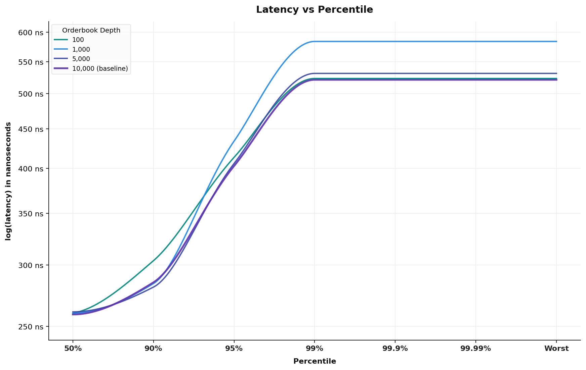
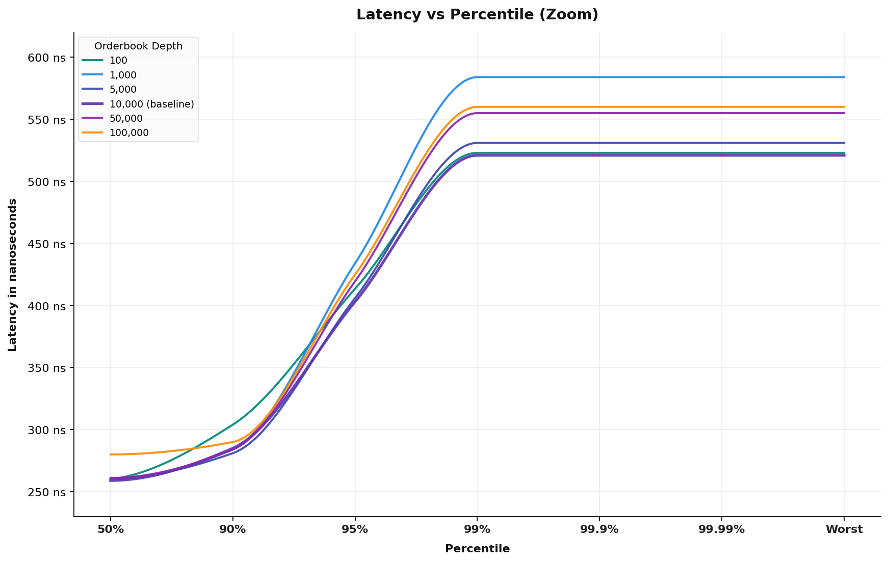

# Order-book engine benchmark results

* Benchmark date: september 21, 2026
* Commit hash: `9b2d1936345ad4457f2a10a08fc11d1c7f99366c`
* Cpu: intel core ultra 7 265k (20 cores, 20 threads)

---

### Benchmark results

| Rate | depth | batch size | spread | lot size | cancel% | taker% | 50.0% | 90.0% | 95.0% | 99.0% | 99.9% | worst |
| :--- | :--- | :--- | :--- | :--- | :--- | :--- | :--- | :--- | :--- | :--- | :--- | :--- |
| 3.38m | 1,000 | 100,000 | 3 | 10 | 20% | 10% | 241ns | 270ns | 378ns | 485ns | 536ns | 536ns |
| 3.30m | 5,000 | 100,000 | 5 | 30 | 20% | 10% | 255ns | 276ns | 377ns | 478ns | 539ns | 539ns |
| 4.64m | 10,000 | 100,000 | 5 | 20 | 45% | 11% | 168ns | 212ns | 319ns | 426ns | 507ns | 507ns |
| 3.41m | 10,000 | 100,000 | 10 | 50 | 20% | 40% | 242ns | 265ns | 276ns | 286ns | 291ns | 291ns |
| 3.29m | 10,000 | 100,000 | 5 | 3 | 20% | 10% | 251ns | 273ns | 405ns | 538ns | 556ns | 556ns |
| 3.21m | 10,000 | 100,000 | 5 | 50 | 20% | 10% | 262ns | 285ns | 383ns | 481ns | 546ns | 546ns |
| 3.11m | 10,000 | 100,000 | 5 | 500 | 20% | 10% | 270ns | 293ns | 421ns | 549ns | 556ns | 556ns |
| 2.96m | 10,000 | 100,000 | 3 | 100 | 12% | 5% | 296ns | 316ns | 434ns | 552ns | 560ns | 560ns |
| 2.89m | 10,000 | 100,000 | 50 | 50 | 20% | 10% | 286ns | 326ns | 444ns | 562ns | 586ns | 586ns |
| 3.15m | 50,000 | 100,000 | 5 | 200 | 20% | 18% | 265ns | 285ns | 412ns | 538ns | 548ns | 548ns |
| 3.07m | 50,000 | 100,000 | 5 | 50 | 20% | 10% | 269ns | 293ns | 396ns | 499ns | 512ns | 512ns |
| 3.09m | 100,000 | 100,000 | 20 | 50 | 20% | 25% | 270ns | 286ns | 299ns | 311ns | 558ns | 558ns |

---

### Orderbook depth latency visualization

---

### Benchmark configuration

Single symbol order book running in parallel isolation.

Inbound messages distribution (realistic mid-tier baseline):
* 65.0% limit passive orders (gtc)
* 20.0% cancel commands
* 7.0% immediate-or-cancel / fill-and-kill (fak) aggressor orders
* 5.0% order modification commands
* 3.0% fill-or-kill (fok) aggressor orders

Order book parameters:
* Orderbook depth: 100 to 1,000,000 active resting price levels (10,000 baseline)
* Batch size: 1 to 1,000,000 messages per dispatch cycle (100,000 baseline)
* Seed spread: 50 price ticks
* Passive spread window: 5 price ticks from top of book
* Order quantity: up to 50 contracts per limit order
