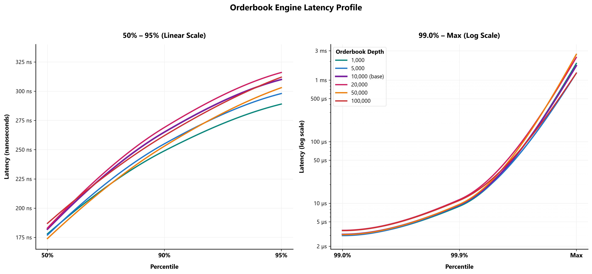
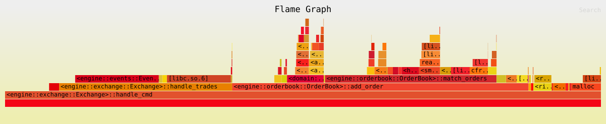

# Order-book engine benchmark results

* Benchmark date: september 26, 2026
* Last updated: september 26, 2026
* Cpu: intel core ultra 7 265k (20 cores, 20 threads)
* Environment: Native Linux (Ubuntu 24.04 LTS, ext4)

---

### Benchmark results

| throughput (ops) | depth | batch size | 50.0% | 90.0% | 95.0% | 99.0% | 99.9% | worst |
| :--- | :--- | :--- | :--- | :--- | :--- | :--- | :--- | :--- |
| 3.69 million | 1,000 | 1,000 | 180ns | 255ns | 295ns | 3.09µs | 9.78µs | 0.83ms |
| 3.81 million | 1,000 | 10,000 | 178ns | 252ns | 294ns | 3.08µs | 9.78µs | 2.28ms |
| 3.57 million | 1,000 | 50,000 | 191ns | 271ns | 316ns | 3.52µs | 10.56µs | 1.29ms |
| 3.94 million | 1,000 | 100,000 | 178ns | 249ns | 289ns | 3.01µs | 8.93µs | 1.87ms |
| 2.88 million | 5,000 | 1,000 | 195ns | 298ns | 507ns | 4.21µs | 12.59µs | 1.03ms |
| 3.52 million | 5,000 | 10,000 | 186ns | 266ns | 315ns | 3.62µs | 11.01µs | 0.41ms |
| 3.85 million | 5,000 | 50,000 | 178ns | 255ns | 298ns | 3.06µs | 9.78µs | 1.29ms |
| 3.93 million | 5,000 | 100,000 | 177ns | 255ns | 298ns | 2.98µs | 9.24µs | 1.30ms |
| 2.38 million | 10,000 | 1,000 | 198ns | 335ns | 1.49µs | 4.39µs | 13.16µs | 1.53ms |
| 3.48 million | 10,000 | 10,000 | 186ns | 273ns | 330ns | 3.39µs | 10.63µs | 2.66ms |
| 3.64 million | 10,000 | 50,000 | 184ns | 267ns | 311ns | 3.49µs | 10.58µs | 1.30ms |
| 3.83 million | 10,000 | 100,000 | 182ns | 265ns | 310ns | 3.12µs | 9.45µs | 1.72ms |
| 1.80 million | 20,000 | 1,000 | 197ns | 360ns | 3.18µs | 5.96µs | 13.30µs | 1.41ms |
| 3.28 million | 20,000 | 10,000 | 187ns | 275ns | 336ns | 3.71µs | 12.18µs | 2.37ms |
| 3.52 million | 20,000 | 50,000 | 185ns | 272ns | 325ns | 3.69µs | 11.81µs | 1.31ms |
| 3.59 million | 20,000 | 100,000 | 183ns | 269ns | 316ns | 3.63µs | 11.45µs | 2.34ms |
| 1.20 million | 50,000 | 1,000 | 190ns | 356ns | 5.33µs | 13.46µs | 17.54µs | 1.14ms |
| 1.98 million | 50,000 | 10,000 | 185ns | 300ns | 2.48µs | 6.69µs | 13.14µs | 3.45ms |
| 3.74 million | 50,000 | 50,000 | 174ns | 252ns | 303ns | 3.06µs | 9.85µs | 3.72ms |
| 3.83 million | 50,000 | 100,000 | 174ns | 253ns | 303ns | 3.09µs | 9.58µs | 2.62ms |
| 0.98 million | 100,000 | 1,000 | 201ns | 375ns | 4.76µs | 21.62µs | 31.44µs | 1.43ms |
| 1.17 million | 100,000 | 10,000 | 197ns | 332ns | 3.61µs | 17.50µs | 23.33µs | 1.18ms |
| 3.16 million | 100,000 | 50,000 | 187ns | 263ns | 329ns | 3.73µs | 11.50µs | 1.59ms |
| 3.45 million | 100,000 | 100,000 | 187ns | 262ns | 312ns | 3.59µs | 11.12µs | 1.30ms |

---

### Orderbook depth latency visualization

---

### CPU execution profile (`Exchange::handle_cmd`)

| Subsystem | Function | CPU % | Source Location |
| :--- | :--- | :--- | :--- |
| **Command Router** | `Exchange::handle_cmd` | 100.00% | [`packages/engine/src/exchange.rs#L68`](../packages/engine/src/exchange.rs#L68) |
| **Order Book** | `OrderBook::add_order` | 49.73% | [`packages/engine/src/orderbook.rs#L209`](../packages/engine/src/orderbook.rs#L209) |
| **Trade Settlement** | `Exchange::handle_trades` | 29.05% | [`packages/engine/src/exchange.rs#L195`](../packages/engine/src/exchange.rs#L195) |
| **Matching Engine** | `OrderBook::match_orders` | 28.79% | [`packages/engine/src/orderbook.rs#L86`](../packages/engine/src/orderbook.rs#L86) |
| **Event Dispatch** | `EventDispatcher::try_send` (trades) | 14.05% | [`packages/engine/src/events.rs#L272`](../packages/engine/src/events.rs#L272) |
| **Price Level** | `PriceLevel::insert` | 6.16% | [`packages/domain/src/level.rs#L43`](../packages/domain/src/level.rs#L43) |
| **Memory Allocator** | `malloc` (glibc) | 5.02% | System allocator |
| **Trade Buffer** | `SmallVec::reserve_one_unchecked` | 3.52% | SmallVec expansion |
| **Order Book** | `BTreeMap::remove_kv` (bids/asks) | 3.26% | Level deletion |
| **Risk Engine** | `RiskEngine::check_and_reserve` | 3.02% | [`packages/risk/src/risk_engine.rs#L481`](../packages/risk/src/risk_engine.rs#L481) |
| **Order Index** | `HashMap::remove_entry` | 2.99% | Order index lookup/removal |
| **Risk Engine** | `RiskEngine::check` | 2.85% | [`packages/risk/src/risk_engine.rs#L485`](../packages/risk/src/risk_engine.rs#L485) |
| **Risk Engine** | `RiskEngine::reserve` | 2.09% | [`packages/risk/src/risk_engine.rs#L526`](../packages/risk/src/risk_engine.rs#L526) |
| **Order Book** | `BTreeMap::or_default` | 2.12% | Level creation |
| **Price Level** | `PriceLevel::pop_front` / `front` | 1.78% | [`packages/domain/src/level.rs#L55`](../packages/domain/src/level.rs#L55) |
| **Event Dispatch** | `EventDispatcher::try_send` (commands) | 1.69% | [`packages/engine/src/events.rs#L272`](../packages/engine/src/events.rs#L272) |
| **Order Index** | `HashMap::insert` | 1.57% | Order index insertion |
| **Risk Engine** | `RiskEngine::settle` | 0.76% | [`packages/risk/src/risk_engine.rs#L430`](../packages/risk/src/risk_engine.rs#L430) |
| **Risk Engine** | `RiskEngine::get_internal_id` | 0.71% | [`packages/risk/src/risk_engine.rs#L568`](../packages/risk/src/risk_engine.rs#L568) |
| **Order Book** | `OrderBook::cancel_order` | 0.50% | [`packages/engine/src/orderbook.rs#L258`](../packages/engine/src/orderbook.rs#L258) |
| **Order Book** | `OrderBook::modify_order` | 0.40% | [`packages/engine/src/orderbook.rs#L298`](../packages/engine/src/orderbook.rs#L298) |
| **Price Level** | `PriceLevel::remove` | 0.31% | [`packages/domain/src/level.rs#L48`](../packages/domain/src/level.rs#L48) |
| **Risk Engine** | `RiskEngine::release` | 0.17% | [`packages/risk/src/risk_engine.rs#L384`](../packages/risk/src/risk_engine.rs#L384) |

---

### Benchmark configuration

Single symbol order book running in parallel isolation.

Inbound messages distribution (realistic mid-tier baseline):
* 65.0% limit passive orders (gtc)
* 20.0% cancel commands
* 7.0% immediate-or-cancel / fill-and-kill (fak) aggressor orders
* 5.0% order modification commands
* 3.0% fill-or-kill (fok) aggressor orders

Order book parameters:
* Orderbook depth: 100 to 1,000,000 active resting price levels (10,000 baseline)
* Batch size: 1 to 1,000,000 messages per dispatch cycle (100,000 baseline)
* Seed spread: 50 price ticks
* Passive spread window: 5 price ticks from top of book
* Order quantity: up to 50 contracts per limit order
